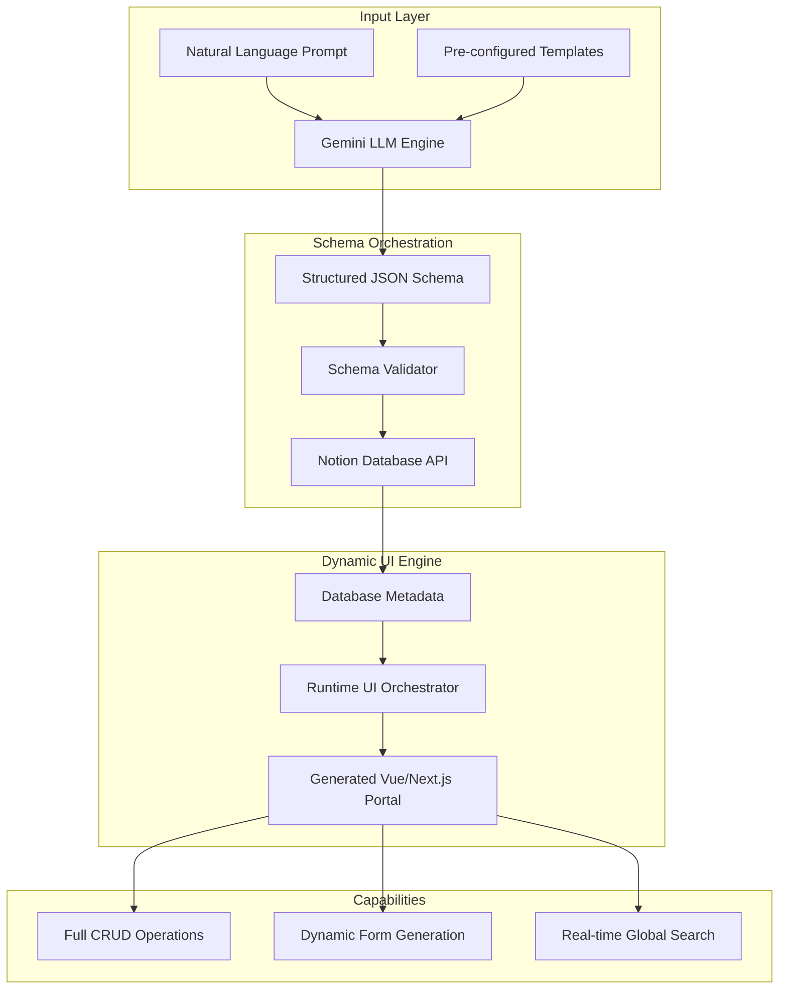

## Engineering Architecture: AI-Driven Software Synthesis

The AI Dynamic CRUD App is an advanced implementation of **Generative Software Engineering**. It moves beyond standard "Chat-based AI" to a system that synthesizes functional software architectures, database schemas, and user interfaces directly from natural language specifications.

### 1. The Generative Pipeline (Layman's Perspective)
Think of this system as a **Digital Architect**. Instead of hiring a team to spend weeks drawing blueprints (Database Schemas) and building the house (User Interface), you simply describe what you need. 

The "Architect" (Gemini AI) draws the technical blueprint in seconds, connects it to a "Foundational Utility" (Notion), and hands you the keys to a fully furnished, functional house (The Web App). If you want to add a room later, you just tell the AI, and the house expands instantly.

### 2. Technical Architecture & Data Flow
The system utilizes a decoupled architecture where the LLM acts as a compiler, turning human intent into machine-readable schema definitions.

### 3. Key Engineering Pillars

#### A. LLM-as-a-Compiler (Prompt Engineering)
The core of the system is a sophisticated prompt-chaining engine. We use strict output constraints to ensure Gemini produces 100% valid, typed JSON. This JSON isn't just data; it's a **Functional Specification** that includes:
- Field Types (Text, Number, Date, Multi-select, Files)
- Relationship Mapping (Notion Relations/Rollups)
- Iconography & Categorization logic

#### B. Dynamic UI Orchestration (Runtime Synthesis)
Unlike traditional apps with hard-coded forms, this frontend is **completely reactive to the backend schema**. 
- **Introspection:** The app "inspects" the Notion database structure at runtime.
- **Component Mapping:** If it detects a "Date" field in Notion, it instantly renders a Date-Picker in the UI. If it sees a "Status" field, it builds a specialized Kanban or Select dropdown.
- **Zero-Code Updates:** Adding a column in the Notion database immediately updates the web portal without a single line of code or a new deployment.

#### C. Multi-Language Intent Parsing
By leveraging LLM semantic understanding, the system supports multi-lingual intent. A prompt in Hindi or Japanese is parsed into the same structured JSON schema, ensuring global accessibility for non-technical users while maintaining strict data integrity.

### 4. Strategic Business Value (ROI)
- **Time-to-Market:** Reduces the "Idea-to-Product" cycle from weeks to minutes.
- **Operational Agility:** Allows ops teams to build and modify their own internal tools without consuming core engineering resources.
- **Zero-Maintenance Infrastructure:** By using Notion as the database and Netlify for the frontend, the system is virtually "serverless" and requires zero backend maintenance.

This project serves as a technical proof-of-concept for **Automated Internal Tooling**, demonstrating how AI can effectively manage the entire lifecycle of a standard business application.
