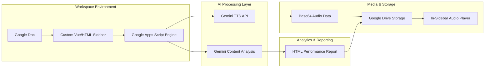

## Engineering Architecture: Ambient AI & Media Synthesis

AI Narrator is a sophisticated **Google Workspace Integration** that transforms Google Docs from a static text editor into an AI-powered media production studio. It demonstrates how to orchestrate distributed cloud services (Gemini, Google Drive, and Apps Script) into a cohesive, zero-friction user workflow.

### 1. The Workflow Engine (Layman's Perspective)
Imagine you have a **Professional Narrator** sitting inside your Google Doc. Instead of copying your script, opening a separate recording app, and manually saving files, you just highlight a paragraph and click a button. 

The "Narrator" (Gemini AI) reads your text, applies your specific instructions (like "speak excitedly" or "use a calm teaching tone"), and instantly places a high-quality audio file into a folder on your desk (Google Drive). It turns your document into a living, breathing media asset without you ever leaving the page.

### 2. Technical Architecture & Media Pipeline
The system is built on an event-driven architecture using Google Apps Script (GAS) to bridge the gap between the document UI and the Gemini Media API.

### 3. Key Engineering Pillars

#### A. The "Direct-to-Drive" Media Pipeline
One of the core technical challenges was handling binary audio data within the constraints of Google Apps Script. We implemented a seamless pipeline where:
- **Text Extraction:** GAS intelligently extracts text, handling complex document structures like tables and lists.
- **Base64 Orchestration:** Binary audio streams from Gemini are converted and passed through the GAS bridge.
- **Automatic Filing:** The system automatically manages a persistent "AI Narrator" folder structure in the user's Drive, ensuring media assets are organized and accessible for post-production.

#### B. Context-Aware Speech Generation
Unlike standard Text-to-Speech (TTS) tools, AI Narrator allows for **Adverbial Instruction Injection**. We don't just send text to the API; we send a "Performance Brief." By wrapping the text with AI-driven tone and style modifiers, we produce audio that matches the *intent* of the content, whether it's an excitable YouTube script or a gentle educational guide.

#### C. Embedded Workflow Architecture
This project is a prime example of **Ambient AI**. Instead of a standalone portal, the logic lives where the content is created. This required:
- **Optimized UI (HTML Service):** A high-performance sidebar that manages state (API keys, voice selections) across multiple document sessions.
- **Asynchronous Processing:** Using `google.script.run` to handle long-running audio generation without freezing the document interface.

### 4. Strategic Business Value (ROI)
- **Reduced Production Overhead:** Lowers the cost of professional narration to nearly zero for educators and creators.
- **Workflow Consolidation:** Eliminates "App Fatigue" by keeping the entire production cycle (Scripting -> Analysis -> Recording) inside Google Docs.
- **Content Accessibility:** Enables rapid generation of audio versions for all written materials, improving compliance and reaching broader audiences.

AI Narrator proves that the most valuable AI tools are not the ones that require new habits, but the ones that **enhance existing ones**.
