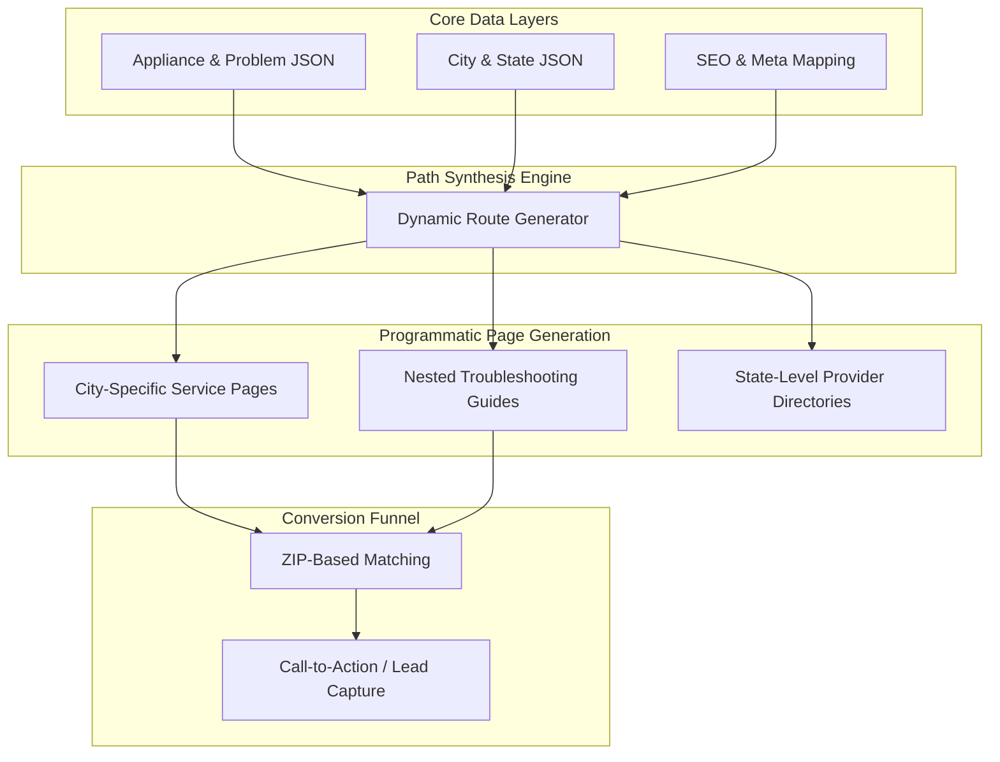

## Engineering Architecture: Programmatic SEO & Lead-Gen Systems

Appliance Repairly is not just a website; it is a **Programmatic Growth Engine**. It is designed to capture high-intent local search demand at scale by automatically generating thousands of search-optimized landing pages across cities, appliance types, and specific technical problems.

### 1. The Growth Engine (Layman's Perspective)
Think of this platform as an **Automated Sales Team** that can be in 10,000 places at once. 

In a traditional setup, you'd have to write a new page for every city (e.g., "Fridge Repair in Austin," "Dryer Repair in Miami"). This system does that automatically. It takes a **Central Knowledge Base** of appliance problems and "mixes" it with a **Database of Locations**. In seconds, it creates thousands of tailored pages that look like they were handcrafted for every specific neighbor in every specific city, ensuring that whenever someone searches for help, we are there to meet them.

### 2. Technical Architecture & Dynamic Routing
The system leverages Next.js 15 for high-performance static generation (SSG) with on-demand revalidation.

### 3. Key Engineering Pillars

#### A. Content-as-Data (JSON Orchestration)
The architecture completely decouples the **Content Strategy** from the **Codebase**. All technical knowledge (symptoms, troubleshooting steps, tools required) is stored in highly structured JSON files. 
- **Scalability:** Adding a new appliance category requires zero code changes—only a JSON update.
- **Consistency:** Ensures that technical terminology and troubleshooting advice remain uniform across 5,000+ generated routes.

#### B. Recursive Dynamic Routing
We implemented a multi-level dynamic routing structure (`[repairSlug]/[problemSlug]/[...troubleshootingSlug]`) that allows for deep, hierarchical search coverage.
- **Path Synthesis:** The system automatically calculates and generates valid URL paths based on the cross-product of appliances and problems.
- **Contextual SEO:** Every page dynamically generates its own Metadata (Title, Description, Schema.org) by combining location data with technical appliance data.

#### C. Performance-First Lead Capture
In local services, speed is the primary driver of conversion.
- **Static Site Generation (SSG):** Pages are pre-rendered at build time, resulting in near-instant load speeds (Lighthouse scores of 95+).
- **Client-Side Location Detection:** Custom hooks manage real-time ZIP code validation and service area matching to ensure the user is connected to a relevant local professional instantly.

### 4. Strategic Business Value (ROI)
- **Zero Cost per Page:** Once the engine is built, the cost of adding 1,000 new pages (new cities/appliances) is negligible.
- **Durable Organic Moat:** By capturing "Long-Tail" search queries (e.g., "leaking LG dishwasher repair in Seattle"), the platform avoids expensive PPC competition and builds long-term organic authority.
- **Conversion Efficiency:** The user journey is strictly engineered to move from *Problem Discovery* (Troubleshooting) to *Transaction* (Provider Matching) in under 3 clicks.

Appliance Repairly demonstrates how **Programmatic SEO** can transform a service business into a high-leverage digital acquisition machine.
