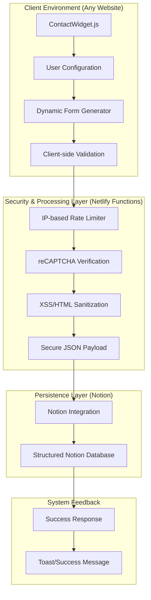

## Engineering Architecture: Serverless Lead-Capture Infrastructure

The Contact Form Plugin is a high-reliability, **Widget-as-a-Service (WaaS)** architecture. It demonstrates how to package complex backend logic (validation, security, and storage) into a lightweight, embeddable JavaScript asset that can be deployed across any web environment with zero infrastructure overhead.

### 1. The Intake Engine (Layman's Perspective)
Think of this plugin as a **Self-Serve Postbox** that you can place on any street corner (website). 

Normally, a postbox needs a complex system to verify the sender, check for "junk mail" (spam), and ensure the letter gets to the right filing cabinet (database). This plugin does all that automatically. You just "drop" the postbox onto your site, and it handles the heavy lifting of checking IDs, filtering out trash, and neatly organizing every message in your digital office (Notion) so you never miss a lead.

### 2. Technical Architecture & Security Flow
The system utilizes a decoupled, serverless architecture to ensure maximum uptime and security without the need for a dedicated backend server.

### 3. Key Engineering Pillars

#### A. The "Generator" Pattern (Configuration-Driven UI)
The core of the plugin is a class-based generator that synthesizes the UI at runtime.
- **Dynamic Synthesis:** The widget "builds" itself based on a JSON configuration object. It injects specific field types (select, tel, email) and applies custom themes (colors, radii) without requiring hard-coded HTML.
- **Deep-Merge Configuration:** Supports a robust "Defaults vs. User-Overrides" pattern, making it highly customizable for developers while remaining simple for basic use.

#### B. Multi-Layered Security Architecture
To prevent spam and injection attacks in a public-facing widget, we implemented a strict security stack:
- **Rate Limiting:** A sliding-window IP monitor prevents automated bot submissions from overwhelming the system.
- **Input Sanitization:** Every field is processed through a server-side sanitizer that strips dangerous tags (`<script>`, `<iframe>`) and event handlers, protecting the backend storage from XSS.
- **Double-Validation:** Validation logic is mirrored on both the client (for UX speed) and the server (for data integrity).

#### C. Build-Time Environment Injection
To keep the widget lightweight and avoid hard-coding secrets, the build pipeline (`build-inject-env.js`) dynamically injects environment-specific variables like API endpoints and CAPTCHA keys. This allows the same source code to be deployed across different staging and production environments seamlessly.

### 4. Strategic Business Value (ROI)
- **Reduced Implementation Time:** Deploying a custom, secure lead-capture form takes minutes instead of hours of backend development.
- **Zero Maintenance:** By using serverless functions and Notion, there are no databases to manage or servers to patch.
- **Scalable Data Intake:** All leads are centralized in a structured Notion database, allowing teams to use it as a lightweight CRM without paying for expensive enterprise software.

This project is a technical blueprint for **Productizing Reusable Components**, turning a common development task into a scalable architectural asset.
