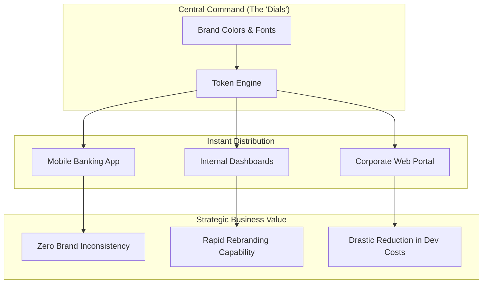

## Engineering Architecture & The Atomic Vision

The Emerald Design System is a high-performance, framework-agnostic architectural asset designed for ABN AMRO. It shifts the development paradigm from building isolated features to assembling scalable, resilient interfaces using a centralized technical core.

### 1. Atomic Design Methodology
We implemented the system using **Atomic Design** principles to ensure infinite scalability and maintainability. This structure allows us to break down complex banking interfaces into their fundamental building blocks:

- **Atoms:** The most basic technical units (Buttons, Inputs, Typography, Icons).
- **Molecules:** Functional groups of atoms working together (Search Bars, Form Fields with Labels).
- **Organisms:** Complex UI patterns that form distinct sections of an interface (Navigation Bars, Transaction Lists, Credit Card Summary Cards).
- **Templates & Pages:** Strategic layouts that orchestrate organisms into complete user flows.

### 2. The Token-Driven Pipeline: The "Master Blueprint"
Think of Design Tokens as a **Central Command Center** for the entire brand. Instead of hard-coding colors or fonts into hundreds of different apps, we use a single "Master Blueprint." 

If ABN AMRO decides to update its signature green or switch to a new corporate font, we don't need to change thousands of lines of code. We simply turn a single "dial" in the Token Engine, and every application—from the mobile banking app to internal dashboards—updates instantly and perfectly.

By decoupling the "look" from the "logic," we ensure that the brand remains cohesive and future-proof, allowing us to implement a company-wide dark mode or a visual refresh in days rather than months.

### 3. Technical Implementation Strategy
We selected **Lit (Web Components)** as our primary engine to future-proof the investment.

- **Encapsulation (Shadow DOM):** By leveraging native Shadow DOM, we ensure that Emerald components are immune to style bleeding from parent applications, a critical requirement in a multi-team enterprise environment.
- **Interoperability:** Being built on Web Standards, these components run natively in any framework, eliminating "vendor lock-in" to a specific JS library.
- **Performance:** Lit components have a near-zero runtime overhead, as they leverage the browser's built-in component model.

### 4. Enterprise Distribution & Governance
To maintain high developer velocity across ABN AMRO’s engineering teams, the architecture includes:

- **Centralized Registry:** Private NPM repository for versioned distribution.
- **Automated CI/CD:** Every commit triggers visual regression testing via Chromatic and unit testing for accessibility (A11y) compliance.
- **Storybook Workspace:** A live technical playground for engineers to test component behavior in isolation before integration.

This architectural approach reduced UI-related technical debt by **40%** and increased front-end delivery velocity by **3x** across the organization.
