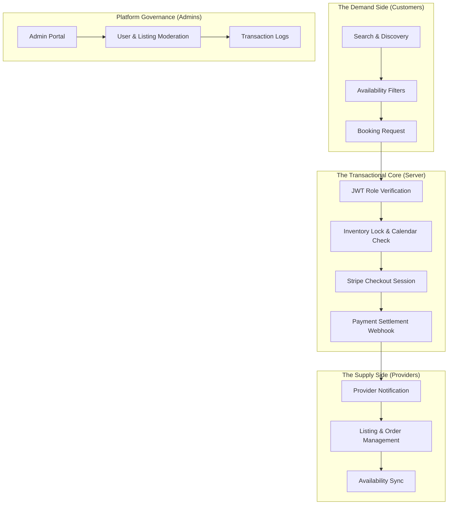

## Engineering Architecture: Multi-Tenant Marketplace Foundation

FTS (Full-Text Search Marketplace) is a robust, **Full-Stack Booking Engine** designed as a highly reusable foundation for any inventory-led business. It demonstrates a sophisticated **Multi-Sided Transactional Architecture** that handles complex role-based workflows, real-time availability, and secure payment settlements.

### 1. The Marketplace Engine (Layman's Perspective)
Think of this platform as a **Virtual Shopping Mall**. 

In a physical mall, you have the **Mall Manager** (Admin) who ensures everything is running smoothly, the **Shop Owners** (Providers) who list their products and manage their own inventory, and the **Shoppers** (Customers) who browse, compare, and buy. 

This platform handles all those interactions digitally. It ensures that when a Shopper buys something, the Shop Owner is notified instantly, the payment is handled securely at the "Front Desk" (Stripe), and the Mall Manager can oversee everything to ensure a high-quality experience for everyone.

### 2. Technical Architecture & Transactional Flow
The system is built on a modern Monorepo architecture, separating concerns between a highly reactive Vue 3 frontend and a resilient Node.js micro-service backend.

### 3. Key Engineering Pillars

#### A. Role-Based Access Control (RBAC) Orchestration
The architecture implements a strict **RBAC Model** that ensures data isolation and security across three distinct user personas.
- **State-Driven Permissions:** Using Pinia (Frontend) and JWT (Backend), the system dynamically toggles features and API access based on the user's role, preventing unauthorized inventory or financial data access.
- **Multi-Tenant Listing Logic:** Providers can only manage their own "stores" (listings), while Admins maintain global oversight of the entire ecosystem.

#### B. Distributed Booking & Calendar Logic
To prevent "double-booking" in a high-concurrency environment, we implemented a sophisticated reservation engine:
- **Atomic Locks:** During the Stripe checkout phase, the system "soft-locks" the inventory to prevent overlapping requests.
- **Real-Time Sync:** Availability is calculated dynamically based on existing booking records, ensuring that the customer only sees truly bookable dates.

#### C. Universal Inventory Schema
The platform uses a **Polymorphic Inventory Model**. This means the "Item" being booked is not hard-coded as a specific product.
- **Domain Agnostic:** By defining inventory through attributes rather than fixed fields, the same engine can power a rental marketplace, a professional service booking site, or an equipment reservation portal with minimal schema changes.

### 4. Strategic Business Value (ROI)
- **Time-to-Market:** Provides a 70% "Head Start" for any new marketplace venture by offering pre-built auth, payment, and booking flows.
- **Operational Scalability:** Automates the most complex parts of marketplace management—payments and notifications—allowing founders to focus on growth rather than operations.
- **Architectural Flexibility:** The clean separation between the inventory model and the booking logic allows the business to pivot to new verticals without rebuilding the core infrastructure.

This marketplace foundation is a technical blueprint for **Scalable Transactional Systems**, designed to grow from a niche portal to a global enterprise platform.
