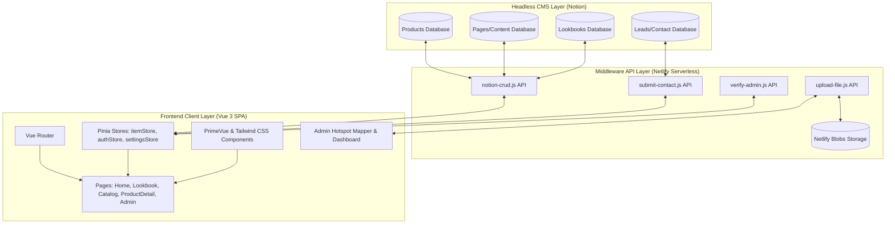

## Engineering Architecture: Notion-Powered Headless Commerce

The Premium Furniture Landing Page & Catalog (Livwood) represents a highly optimized implementation of a **Headless CMS eCommerce Architecture**. By leveraging Notion as a database backend and Netlify serverless functions as a secure middleware layer, it provides a cost-effective, zero-maintenance admin interface for client showrooms.

### 1. Architectural Overview (Layman's Perspective)
Think of this system as a **Self-Updating Storefront**. Normally, updating a catalog or mapping interactive price tags requires database administration or code deployments. 

With this architecture, showroom managers simply use Notion—a tool they already use for daily tasks—to add products, edit copy, or look at customer inquiries. The website automatically detects these changes, maps product pins onto showroom images, and streams lead data back to Notion. The store virtually runs itself without any custom database hosting costs.

### 2. Technical Data Flow & Infrastructure
The system uses a decoupled three-tier structure that connects the client frontend, serverless API gateway, and Notion headless CMS.

### 3. Key Engineering Pillars

#### A. Dynamic DB Auto-Discovery
Unlike standard implementations requiring hardcoded database IDs in environment variables, the backend features a **dynamic schema resolver**. By passing a single parent page ID, the Netlify Functions query the parent page blocks to auto-discover child inline databases based on semantic keyword matching (`product`, `lookbook`, `page`, `lead`). This makes workspace setup trivial and permits seamless schema versioning.

#### B. Interactive Hotspot Mapper (HTML5 Canvas)
To solve the friction of mapping coordinates on high-resolution photos, the admin panel embeds an interactive canvas.
- **Coordinate Normalization**: Translates raw client-side click events into percentage-based `(x, y)` coordinates relative to the image aspect ratio.
- **Relational Mapping**: Associated products are linked using Notion's relation property types, allowing the frontend lookbook to dynamically fetch live pricing, descriptions, and slugs.
- **Dynamic CSS Tooltips**: Mapped percentages are rendered on the frontend using responsive tooltips that scale cleanly across mobile and desktop.

#### C. Serverless Security & Gateway Proxy
Netlify Serverless Functions serve as a proxy layer to ensure security and performance:
- **Token Obfuscation**: Hides Notion API integration tokens and reCAPTCHA private keys from client-side network inspectors.
- **API Rate Limiting & Verification**: Protects lead ingestion endpoints with server-side Google reCAPTCHA v2 verification and request rate limiters to prevent bot spam.
- **Data Sanitization**: Normalizes Notion rich-text outputs and sanitizes customer inputs before writing back to the databases to prevent XSS.

#### D. Image Pipeline & Netlify Blobs Ingestion
Because Notion's file hosting limits external API write operations, we engineered a custom file-upload pipeline:
- **Blobs Ingestion**: The admin panel uses serverless handlers to ingest image assets directly into Netlify Blobs storage.
- **URL Synchronization**: The returned public asset URLs are stored in the Notion database properties, bypassing upload restrictions and ensuring high availability.

### 4. Strategic Business Value (ROI)
- **Zero Database Infrastructure Cost**: Replaces expensive database clusters (PostgreSQL/MongoDB) with Notion, running completely on free tier serverless nodes.
- **Empowered Non-Technical Teams**: Showroom owners edit catalogs, homepage headlines, and lookbooks without needing a developer or a CMS dashboard license (e.g. Contentful/Sanity).
- **Consolidated CRM Operations**: Bypasses the need for third-party CRM tools by logging leads directly into Notion, keeping business ops centralized.
