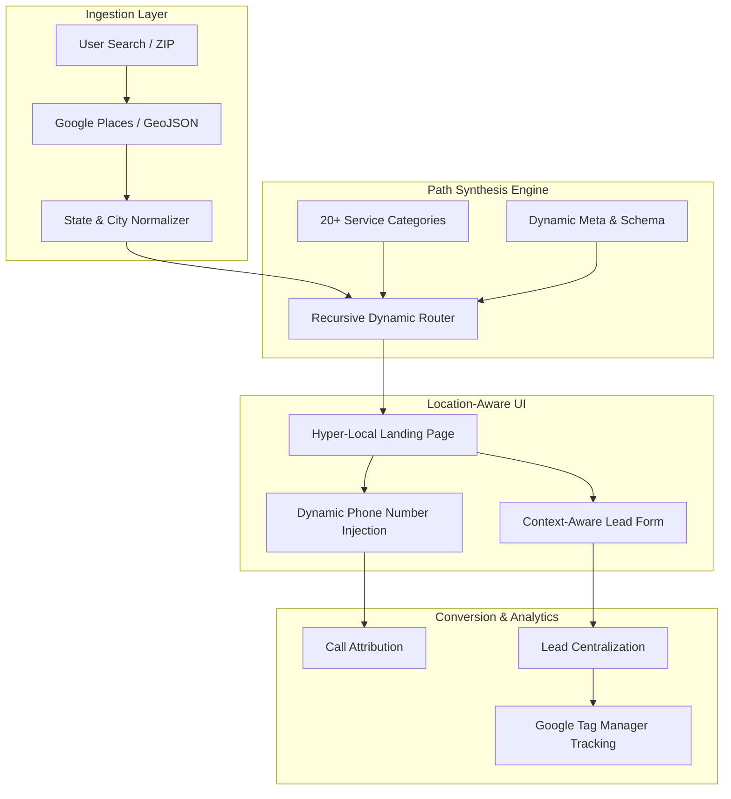

## Engineering Architecture: Geo-Distributed Lead Acquisition Engine

LocalXR is an enterprise-grade **Programmatic SEO (pSEO) platform** designed for high-scale geographic lead generation. It leverages a sophisticated dynamic routing system and location-aware orchestration to deliver hyper-relevant landing pages for over 20+ service categories across thousands of US cities.

### 1. The Growth Engine (Layman's Perspective)
Think of LocalXR as a **GPS-Guided Digital Directory**. 

Instead of a single "Plumbing" page that tries to serve everyone, LocalXR creates a custom "Front Door" for every specific neighborhood in America. If you are in Austin searching for a plumber, the system detects your location and instantly "builds" a page that features local Austin plumbers, specific Austin service numbers, and content tailored to your city. It's like having a local expert standing on every street corner, ready to help the moment someone asks.

### 2. Technical Architecture & Geographic Orchestration
The platform utilizes Next.js 15 and React 19 to manage a massive hierarchical URL structure while maintaining sub-second page loads.

### 3. Key Engineering Pillars

#### A. Recursive Path Synthesis & Normalization
Managing thousands of location combinations (`/locations/[service]/[state]/[city]`) requires a robust path-handling layer.
- **Semantic Normalization:** We implemented an automated layer that converts state codes (OH) to full names (Ohio) and handles complex URL slugs with whitelist-based validation, ensuring 100% crawlable, SEO-friendly paths.
- **Reserved Word Protection:** A sophisticated validation layer prevents URL injection and ensures that system paths (like `/about` or `/contact`) are never overwritten by generated location slugs.

#### B. Context-Driven Lead Routing
The platform's profitability depends on connecting the right user to the right service provider.
- **Dynamic Phone Injection:** Using a `PhoneNumberContext`, the system injects unique tracking numbers based on the specific service category and geographic region, allowing for precise marketing attribution.
- **Location Context:** A centralized React Context manages the user's geographic state across the entire session, ensuring that once a user selects a city, the entire platform (from header to footer) stays synchronized with that location.

#### C. Performance-Optimized pSEO
Large-scale programmatic sites often suffer from "Crawl Budget" and performance issues. We solved this via:
- **SSG with Dynamic Hydration:** Core content is pre-rendered for SEO, while interactive elements (like the local phone numbers and provider listings) are hydrated dynamically to ensure content is always fresh.
- **Sharp-Powered Image Pipeline:** Every service category image is automatically optimized and converted to WebP format at build time, reducing page weight by up to 60%.

### 4. Strategic Business Value (ROI)
- **Zero-Cost Acquisition:** By ranking for long-tail "Service + City" keywords, the platform generates high-intent leads without the high cost of Google Ads.
- **Rapid Market Expansion:** New service categories or states can be "launched" simply by updating the JSON configuration, allowing the business to test new markets in hours.
- **High-Trust Conversion:** Hyper-local content (mentioning specific cities and states) significantly increases user trust and lead-form completion rates compared to generic national sites.

LocalXR demonstrates how **Advanced Geographic Orchestration** can turn a simple directory into a powerful, automated revenue machine.
