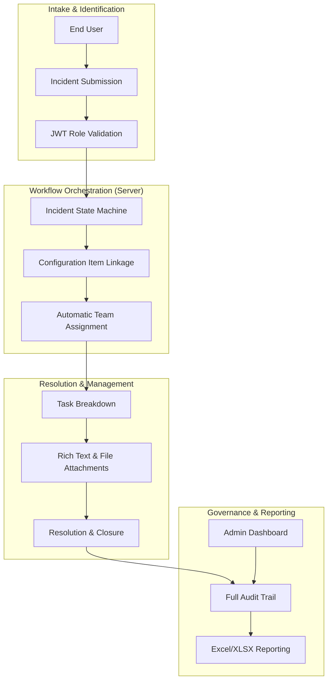

## Engineering Architecture: Enterprise Incident Management Engine

Momentum is a high-performance **Full-Stack ITSM (IT Service Management) platform** designed to replicate the core functionality of enterprise tools like ServiceNow without the associated bloat. It demonstrates a sophisticated **Incident-to-Resolution Lifecycle** powered by a robust role-based workflow engine.

### 1. The Operations Engine (Layman's Perspective)
Think of Momentum as an **Automated Digital Dispatcher**. 

In a busy office, when something breaks (an "Incident"), you normally have to call around, send emails, and hope someone fixes it. This platform acts as the "Dispatcher" who takes the call, instantly categorizes the problem, assigns it to the right "Repair Team" (based on their role), and tracks every step until the job is done. It ensures that nothing falls through the cracks and provides a "Master Dashboard" for management to see exactly how the office is performing in real-time.

### 2. Technical Architecture & Incident Lifecycle
The system utilizes a modern Monorepo architecture, bridging a Vue 3/PrimeVue frontend with a secure Node.js/MongoDB backend.

### 3. Key Engineering Pillars

#### A. State-Driven Workflow Automation
The core of Momentum is a strictly defined **Incident State Machine**. 
- **Deterministic Transitions:** Every ticket follows a validated path (e.g., New -> Assigned -> In Progress -> Resolved). The system prevents "illegal" state jumps, ensuring data integrity for operational audits.
- **Role-Based Visibility:** Using Vue 3 and Pinia, the UI dynamically reconfigures itself based on the user's role. An "End User" sees a simplified submission form, while an "Operations Engineer" sees a complex management console.

#### B. The "Lighter ServiceNow" Pattern
We architected the system to prioritize **Developer Velocity** and **Runtime Performance**.
- **PrimeVue Component Architecture:** By leveraging enterprise-grade components, we delivered a "ServiceNow-like" UX in a fraction of the time, focusing our engineering effort on the business logic rather than the UI primitives.
- **Decoupled API Design:** The backend is built as a RESTful API with full Swagger documentation, allowing for future integrations with third-party automation tools or custom Slack/Teams bots.

#### C. Integrated Configuration Management (CMDB)
Unlike simple task lists, Momentum includes a lightweight **Configuration Item (CI) Model**.
- **Asset Linkage:** Incidents are linked to specific IT assets (Servers, Software, Hardware). This allows for "Impact Analysis"—identifying how a single server failure might affect multiple business services.

### 4. Strategic Business Value (ROI)
- **Enterprise Capabilities, Startup Speed:** Provides the structure of an enterprise ITSM tool with the agility of a custom-built solution.
- **Operational Transparency:** Replaces fragmented emails and spreadsheets with a single, searchable "Source of Truth" for all business operations.
- **Cost Efficiency:** Eliminates the high licensing fees of enterprise platforms while providing a system that is 100% tailored to the company's specific workflows.

Momentum proves that **Targeted Product Architecture** can outperform generic enterprise software by focusing on the specific operational needs of the business.
