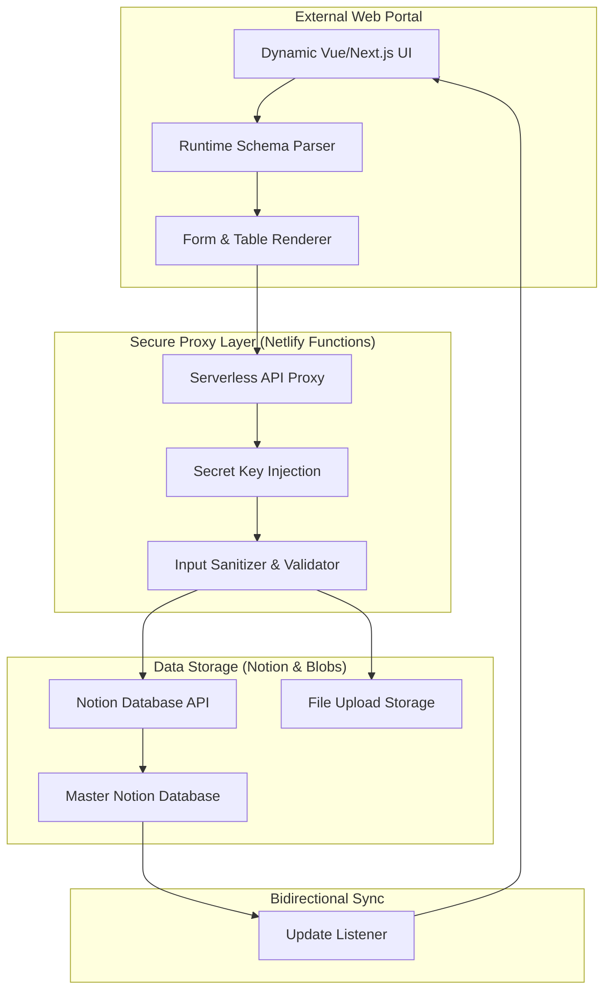

## Engineering Architecture: Serverless Middle-Layer for No-Code Ecosystems

The Notion Web App is a sophisticated **Data-to-Interface Orchestrator**. It demonstrates how to build a high-performance, secure web portal that uses Notion as a "Headless CMS" while maintaining enterprise-grade security, custom UI branding, and advanced features like file uploads that Notion's native sharing doesn't support.

### 1. The Sync Engine (Layman's Perspective)
Think of this app as a **Universal Translator**. 

Notion is like a great filing cabinet (database), but it's built for internal office use. If you want to show that data to the public in a beautiful, branded way, you need a "Translator." This app takes the raw data from your Notion cabinet, "translates" it into a professional website format, and puts it in a "Digital Storefront" (The Web App). When someone outside adds a letter to the storefront's mailbox, the translator neatly files it back into your Notion cabinet instantly.

### 2. Technical Architecture & Data Proxying
The platform utilizes a serverless architecture to bridge the gap between the public internet and the private Notion API, ensuring that your secret keys are never exposed to the user's browser.

### 3. Key Engineering Pillars

#### A. The "Schema-on-Read" Pattern
Unlike traditional apps that require manual coding for every new form field, this system uses **Dynamic Introspection**.
- **Live Metadata Analysis:** The app "reads" the Notion database structure at runtime. If you add a "Status" dropdown in Notion, the web app instantly detects the change and renders a corresponding `<select>` menu in the UI.
- **Zero-Code Maintenance:** This decoupling allows non-technical users to modify the application's data structure entirely within Notion without ever touching the source code.

#### B. Secure Middleware Proxying
Directly connecting a frontend to the Notion API is a major security risk (as it exposes API keys). We implemented a **Secure Proxy Layer**:
- **Environment Isolation:** API keys are stored in secure Netlify environment variables, accessible only to the serverless backend.
- **Payload Sanitization:** Every "Write" request from the web portal is intercepted, sanitized for XSS, and validated against the expected schema before being committed to Notion.

#### C. Hybrid Storage (Notion + Netlify Blobs)
Notion's API has strict limitations on direct file uploads. To overcome this, we architected a **Hybrid Storage System**:
- **Blob Storage:** Files (images, PDFs) are uploaded to high-performance Netlify Blobs.
- **Reference Mapping:** The system then stores a secure, public URL reference back in the Notion database, effectively turning Notion into a media-rich asset manager.

### 4. Strategic Business Value (ROI)
- **Eliminate "App Bloat":** Allows businesses to use their existing Notion workspace as a backend, reducing the number of tools they need to manage.
- **Instant Deployment:** The "Clone-and-Deploy" workflow reduces the cost of launching new internal tools or client portals from thousands of dollars to nearly zero.
- **Universal Accessibility:** Provides a high-performance, mobile-optimized interface for data that is otherwise difficult to navigate in the native Notion mobile app.

This project serves as a technical blueprint for **Headless No-Code Integration**, showing how to build professional software on top of flexible, user-friendly data sources.
