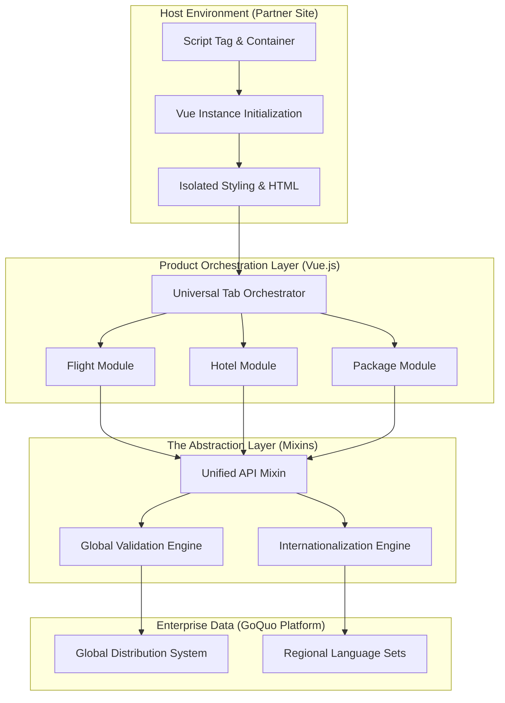

## Engineering Architecture: Modular Embeddable Widget Suite

QA (TUI Travel Widgets) is an enterprise-grade **Modular Frontend System** built to deliver high-conversion travel booking experiences across a distributed network of partner websites. It demonstrates how to architect complex, multi-product search flows into lightweight, embeddable assets that maintain perfect brand consistency and operational reliability.

### 1. The Booking Engine (Layman's Perspective)
Think of these widgets as **Portable Travel Desks**. 

Instead of forcing a customer to go to a physical travel agency or one specific website, you can place a "Travel Desk" (Widget) on any digital street corner—a partner's blog, a news site, or an airline portal. Each desk is fully equipped to handle anything from booking a flight to reserving a car or a hotel. It's smart enough to know exactly which product the customer is looking for and processes the entire request instantly, connecting them to a global network of travel providers without them ever leaving the page.

### 2. Technical Architecture & Integration Flow
The system utilizes a decoupled Vue.js architecture designed for cross-domain embedding, ensuring that the widget logic never conflicts with the host website's scripts or styles.

### 3. Key Engineering Pillars

#### A. The "Universal Product" Abstraction
To manage 25+ different travel forms (Flights, Hotels, Transfers, etc.) without massive code duplication, we implemented a robust **Mixin-Based Architecture**.
- **Shared Logic:** Core features like API communication, error handling, and form validation are abstracted into reusable mixins.
- **Product Specialization:** Individual components (e.g., `SearchFlightForm.vue`) only contain the specific UI and data requirements for their product type, while inheriting all the heavy-lifting logic from the shared mixins.

#### B. Zero-Conflict Embedding Strategy
Travel widgets must run on a variety of partner websites with unpredictable CSS and JS environments. 
- **Scoped Styling:** We used a combination of PostCSS and SASS to ensure that the widget's styles never "bleed" out into the host page, and that the host page's styles don't break the widget's UI.
- **Lifecycle Isolation:** Each widget operates as an independent Vue instance, allowing multiple widgets (e.g., a "Flight Search" and a "Deal Banner") to coexist on the same page without state collision.

#### C. High-Efficiency Internationalization (i18n)
Serving the Malaysia market required support for multiple languages and currencies.
- **Dynamic Translation Mapping:** The system uses a centralized translation engine that re-maps the entire UI based on the user's "Culture Code" at runtime.
- **Regional Formatting:** Everything from date pickers to currency symbols is automatically localized, ensuring a seamless experience for diverse regional users.

### 4. Strategic Business Value (ROI)
- **Market Reach Expansion:** Allows TUI to place booking entry points on thousands of partner sites, drastically increasing the top of the sales funnel.
- **Reduced Maintenance Overhead:** Fixes or feature updates in the core mixins are instantly propagated across all 25+ widget types, ensuring a single source of truth for the entire product suite.
- **Conversion Optimization:** By providing a fast, responsive, and product-specific search experience directly in the user's current context, the widgets minimize "Drop-off" and maximize booking intent.

QA proves that **Modular Frontend Architecture** is the key to scaling complex commercial offerings across a fragmented digital landscape.
