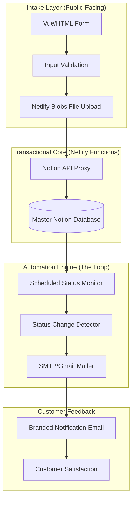

## Engineering Architecture: Serverless Service Intake & Notification Engine

Service Request (Notion-P) is a high-reliability **Service Intake System** designed to bridge the gap between public customer requests and internal operational workflows. It demonstrates a sophisticated **Event-Driven Notification Architecture** that uses Notion as both a database and a trigger for automated customer communication.

### 1. The Operations Engine (Layman's Perspective)
Think of this system as a **Virtual Service Desk** that never sleeps. 

When a customer has a problem, they "drop off" their request at your digital desk (The Web Form). The system instantly logs it in your "Master Ledger" (Notion). But here's the smart part: Whenever you update the status of that request in your ledger (e.g., from "Pending" to "Completed"), the system notice the change and instantly sends a professional email to the customer to let them know. It's like having a dedicated assistant who spends all day watching your notes and keeping your customers perfectly informed.

### 2. Technical Architecture & Automation Loop
The platform utilizes a serverless architecture with a scheduled "Cron" trigger to monitor data changes and orchestrate transactional emails.

### 3. Key Engineering Pillars

#### A. Event-Driven Notification Engine (The "Cron" Loop)
Unlike traditional "Push" systems that require complex webhook setups, this system uses an **Intelligent Polling Pattern**.
- **State Monitoring:** A scheduled Netlify Function runs every few minutes to "scan" the Notion database for status changes.
- **Idempotency Logic:** By tracking "Email Sent" flags within Notion, the system ensures that notifications are only sent once per status change, preventing duplicate emails and ensuring a professional customer experience.

#### B. Dynamic Schema Synthesis
The intake form is designed to be **Metadata-Aware**. 
- **Dynamic Select Fields:** The "Issue Type" dropdown on the web form is not hard-coded; it is fetched directly from the Notion database's "Select" property metadata. This allows business owners to update their service categories in Notion and see the web form update instantly.
- **Typed Data Mapping:** Every form field is strictly mapped to a Notion property type (Date, Email, Status, Files), ensuring 100% data integrity between the public UI and the private database.

#### C. Secure Transactional Emailing
Handling email notifications through a serverless environment requires secure handling of SMTP credentials.
- **App Password Orchestration:** The system uses Gmail's App Password protocol, with all credentials stored in encrypted environment variables, ensuring that no sensitive passwords ever enter the client-side code.
- **HTML Template Engine:** We implemented a responsive HTML email generator (`email-templates.js`) that produces professional, branded emails that look perfect on both mobile and desktop devices.

### 4. Strategic Business Value (ROI)
- **Eliminate Manual Communication:** Automates up to 80% of routine customer status updates, freeing up staff for actual service work.
- **Professional Brand Presence:** Provides a clean, custom-branded interface that is significantly more trustworthy than a standard Google Form or email thread.
- **Zero-Cost Operations:** Built entirely on "Free Tier" services (Netlify, Notion, Gmail), allowing small businesses to run an enterprise-grade service desk for $0/month.

Service Request proves that **Strategic Serverless Orchestration** can transform a simple workspace like Notion into a powerful, automated service operation.
