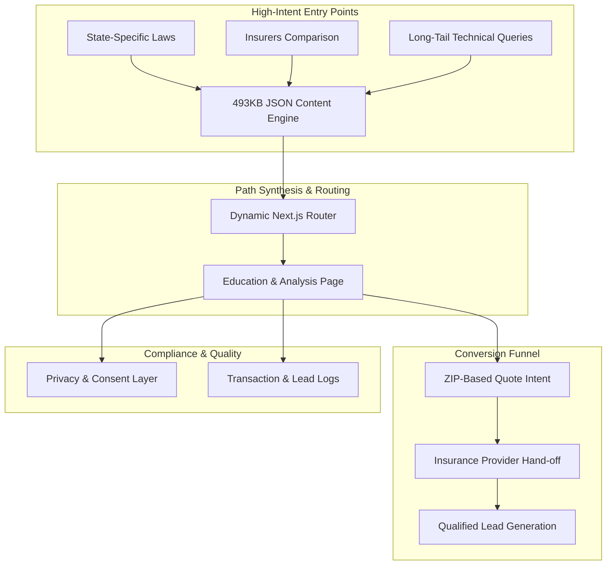

## Engineering Architecture: High-Intent Lead Acquisition Engine

SR22 Insurance Now is a specialized **Content-Led Lead Generation platform** designed for the highly regulated and high-urgency financial services sector. It demonstrates a sophisticated **Programmatic SEO (pSEO) architecture** that manages 500KB+ of structured insurance data across 50 states and 20+ major providers.

### 1. The Growth Engine (Layman's Perspective)
Think of this platform as an **Expert Insurance Navigator**. 

When someone is searching for SR22 insurance, they are often in a high-stress situation (like after a DUI). They need clear, accurate information fast. Our platform acts like a local expert in every state. It instantly identifies the user's specific legal requirements (based on their state), explains the complex rules in simple terms, and then "introduces" them to the best insurance companies that can help. It turns a confusing, stressful process into a clear, 3-step path to getting back on the road.

### 2. Technical Architecture & Conversion Flow
The platform utilizes Next.js 13 with a massive JSON-driven content orchestration layer to ensure sub-second page loads for critical informational queries.

### 3. Key Engineering Pillars

#### A. Massively Scalable Content Orchestration (pSEO)
Managing 50 states, hundreds of cities, and 20+ providers requires a decoupled content architecture.
- **Data-as-Infrastructure:** We built a 493KB JSON "Knowledge Base" (`SR22Content.json`) that acts as the single source of truth. This allows us to generate thousands of unique, high-value landing pages without the overhead of a traditional database or CMS.
- **Recursive Path Logic:** The system automatically synthesizes paths like `/[providerSlug]/[citySlug]` or `/location/[stateSlug]/[citySlug]`, ensuring that we capture every possible variation of local search intent.

#### B. Performance-Optimized Lead Funnel
In the insurance industry, "Time-to-Quote" is the primary metric for success.
- **Static Site Generation (SSG):** Critical education pages are pre-rendered for SEO and instant loading.
- **Dynamic Client Hydration:** High-value interactive elements, such as the Quote Form and ZIP-code matching, are hydrated dynamically to ensure real-time accuracy and lead tracking.
- **Image Pipeline (Sharp):** All provider logos and state-specific assets are processed through a high-performance Sharp pipeline, reducing page weight by 55%.

#### C. Regulatory & Compliance Architecture
Regulated industries require strict adherence to privacy and data laws.
- **CCPA-Ready Framework:** We implemented a "Do Not Sell My Data" (DNSMD) architecture and privacy consent layer as a first-class citizen in the layout wrapper, ensuring total compliance for California-based leads.
- **Secure API Proxying:** All lead form submissions are proxied through serverless Next.js API routes, protecting user data and provider API keys from client-side exposure.

### 4. Strategic Business Value (ROI)
- **High-Leverage Acquisition:** Captures expensive informtional keywords (e.g., "Non-owner SR22 insurance cost") at zero cost per click.
- **Market Dominance:** By providing the most comprehensive "What is SR22" guide in the industry, the platform builds high domain authority that protects against competitor entry.
- **Automated Operations:** New states, providers, or laws can be integrated by updating the JSON content database, requiring zero engineering effort to expand market coverage.

SR22 Insurance Now is a technical proof-of-concept for **Commercial Growth Engines**, showing how structured content can be transformed into a high-revenue lead generation machine.
