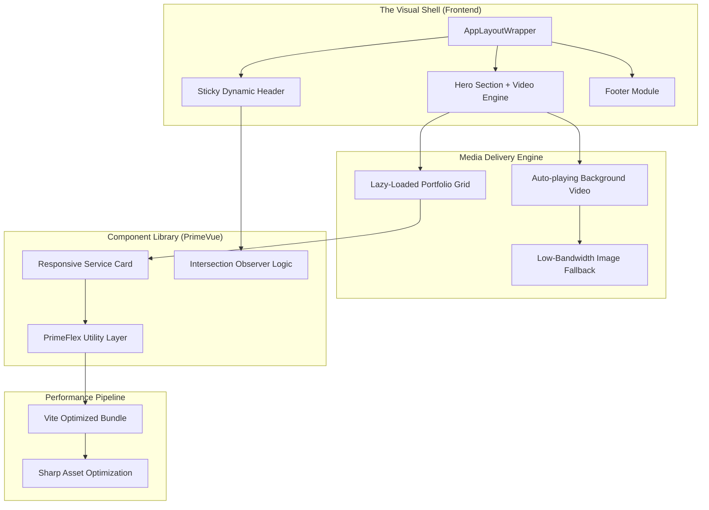

## Engineering Architecture: High-Performance Creative Service Portal

TechCreate (Koro) is a premium **Vue-based Brand Architecture** designed for a high-end creative agency. It demonstrates how to combine immersive media (4K video backgrounds, high-density galleries) with a lightweight, component-driven frontend that maintains sub-second performance and perfect responsiveness.

### 1. The Presentation Engine (Layman's Perspective)
Think of TechCreate as a **High-End Digital Showroom**. 

When a customer walks into a luxury car showroom, the lighting, the layout, and the visuals all signal quality before a single word is spoken. This website does the same for a creative business. It uses "Cinematic Backgrounds" and "Interactive Displays" (Video Portfolios) to instantly show the customer that we are experts in cutting-edge technology. It's built to look expensive and premium while being incredibly fast and easy to navigate on any device.

### 2. Technical Architecture & Asset Orchestration
The platform utilizes a modern SPA (Single Page Application) architecture, prioritizing asset optimization and reactive UI states for an "App-like" feel.

### 3. Key Engineering Pillars

#### A. Cinematic Performance Architecture
Integrating high-resolution video into a web portal often degrades performance. We solved this via:
- **Asynchronous Media Loading:** Background videos are loaded after the critical "First Meaningful Paint," ensuring the user sees the content instantly while the heavy media hydrates in the background.
- **Intelligent Error Fallbacks:** Using Vue 3's reactive `handleVideoError` logic, the system automatically switches to static high-resolution WebP images if a video fails to load or the user is on a slow connection.

#### B. Component-Driven Branding (The PrimeVue Stack)
Instead of building a "one-off" website, we created a **Scalable UI System**.
- **Utility-First Layouts:** By using PrimeFlex (a CSS utility framework), we ensured that every section—from the 4-column service grid to the contact form—is 100% responsive and maintainable without complex custom CSS.
- **Theme Orchestration:** The site uses the "Aura" theme preset, allowing for global brand updates (colors, typography, spacing) to be made in a single configuration file.

#### C. Interaction & State Management
The UI feels "alive" due to sophisticated event handling:
- **Scroll-Aware Navigation:** The header dynamically reconfigures its branding (color, transparency, size) based on the user's scroll position, providing a high-end "app" feel.
- **Reactive Portfolio Engine:** The "Featured Work" section uses reactive arrays to manage complex media types (Video vs. Image), ensuring that the layout remains stable regardless of the content being served.

### 4. Strategic Business Value (ROI)
- **Instant Brand Authority:** Signals technical expertise through high-end UI execution, allowing the agency to command higher project fees.
- **Maintenance Scalability:** The component-based structure allows the team to add new services or portfolio items in minutes, not days.
- **Multi-Device Conversion:** Ensures a premium experience on mobile devices (where 50%+ of traffic originates), preventing "Lead Leakage" from poorly optimized mobile sites.

TechCreate proves that **Strategic Frontend Engineering** is the foundation of a modern, high-trust digital brand.
