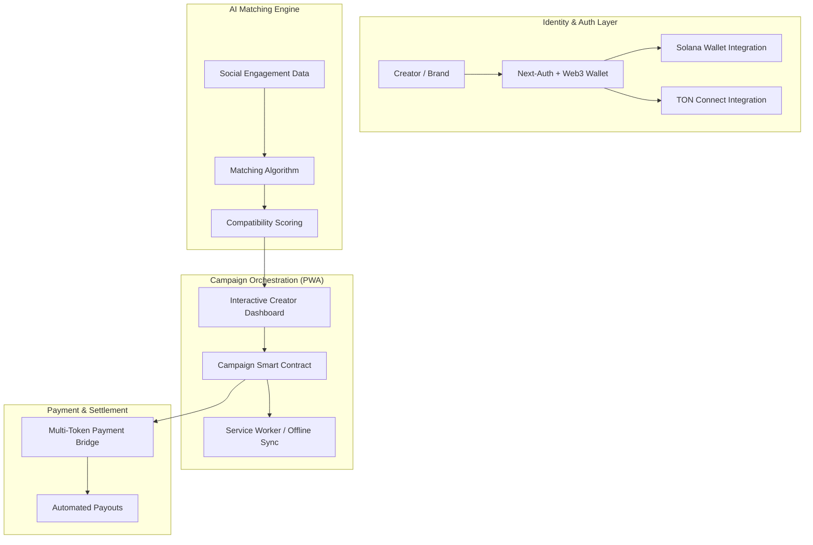

## Engineering Architecture: Web3 Social-Commerce Orchestration

Vibe3 is a high-performance **AI-powered Marketplace Architecture** designed to bridge the gap between premium brands and Web3 content creators. It demonstrates a sophisticated integration of **Next.js 15**, **Blockchain Wallets**, and **PWA (Progressive Web App)** technology to deliver a mobile-first, transactionally secure influencer economy.

### 1. The Marketing Engine (Layman's Perspective)
Think of Vibe3 as an **Automated Digital Talent Agent**. 

In the old world, a brand would spend weeks searching for the right influencer, negotiating deals, and worrying about payments. Vibe3 does all of this in seconds. Our "Digital Agent" (AI) analyzes thousands of creators, finds the perfect match for a brand's specific "vibe," and handles the entire contract and payment process instantly using secure "Digital Handshakes" (Blockchain). It's a high-speed, high-trust marketplace that lives right on your phone's home screen like a native app.

### 2. Technical Architecture & Blockchain Flow
The platform utilizes a modern React 19 / Next.js 15 stack, orchestrating a complex set of decentralized identity and payment protocols.

### 3. Key Engineering Pillars

#### A. Multi-Chain Identity Architecture
Integrating Web3 wallets (Solana and TON) into a standard SaaS workflow requires a robust **Identity Layer**.
- **Unified Session Management:** We implemented a custom Next-Auth adapter that bridges traditional OAuth (Social Login) with Wallet-based authentication, allowing users to transition seamlessly between "Web2" convenience and "Web3" security.
- **Cross-Chain Interoperability:** The frontend manages multiple blockchain providers (`@solana/web3.js` and `@tonconnect/ui-react`) within a single reactive state, ensuring that transaction signatures and wallet statuses are synchronized across the entire app.

#### B. High-Fidelity Cyber-Design System
To compete in the influencer space, the UI must be "Consumer-Grade."
- **Glassmorphism & Neon Layering:** Built with Tailwind CSS v4, the design system utilizes advanced backdrop-filters and gradient animations to create a "Cyber-Themed" aesthetic that resonates with tech-native creators.
- **PWA Mobility:** The platform is architected as a full Progressive Web App. By leveraging Service Workers and a custom manifest, Vibe3 achieves "Installability," allowing it to bypass app store friction while maintaining a native-app feel and offline accessibility.

#### C. AI-Assisted Content Orchestration
The "Suggested Post" interface is a technical showcase of **LLM-UI Integration**.
- **Real-Time Synthesis:** The UI dynamically adapts AI-generated content suggestions into platform-specific previews (Instagram vs. X vs. TikTok) at runtime, allowing creators to iterate on campaign briefs in seconds.
- **Engagement Prediction UI:** We built interactive ROI visualization widgets that translate complex data models into simple, actionable insights for brands.

### 4. Strategic Business Value (ROI)
- **Reduced Onboarding Friction:** By offering both Social and Wallet login, Vibe3 captures a broader audience than pure-crypto platforms.
- **Enterprise-Scale Security:** Blockchain-based campaign settlements eliminate "Payment Risk" and reduce administrative overhead by up to 90%.
- **High Retention PWA:** Being "installed" on a user's home screen significantly increases campaign participation rates and platform engagement compared to traditional web portals.

Vibe3 proves that **Modern Product Architecture** is about the elegant fusion of AI, Blockchain, and premium Frontend engineering.
