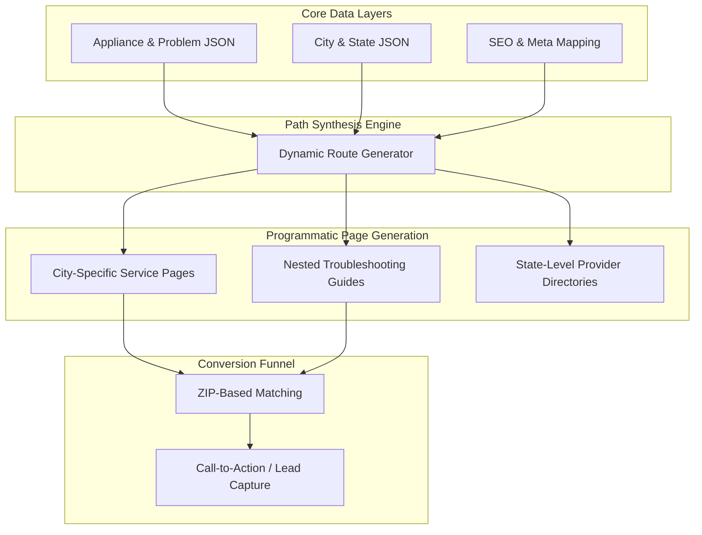

<section class="mt-4 mb-6">
  

    

      
Project Case Study

      <h1 class="text-4xl md:text-6xl font-bold mb-3 mt-0 line-height-2">{{$frontmatter.project.name}}</h1>
      
{{$frontmatter.project.description}}

      

        

          

             

                <i class="pi pi-briefcase text-primary text-2xl"></i>
                

                  
Industry

                  
{{$frontmatter.project.domain}}

                

             

          

          

             

                <i class="pi pi-bolt text-primary text-2xl"></i>
                

                  
Project Status

                  
Scale & Growth

                

             

          

          

             <Stacks :stack="$frontmatter.project.stack" :other-skills="$frontmatter.project.otherSkills" />
          

        

        

           

              <a v-if="$frontmatter.project.link" :href="$frontmatter.project.link" target="_blank" class="no-underline flex-1">
                <Button label="View Live Demo" icon="pi pi-external-link" severity="primary" class="w-full font-bold py-3" raised rounded />
              </a>
              <a v-if="$frontmatter.project.codeLink" :href="$frontmatter.project.codeLink" target="_blank" class="no-underline flex-1">
                <Button label="View Source Code" icon="pi pi-github" severity="secondary" class="w-full font-bold py-3" raised rounded />
              </a>
              <a v-if="$frontmatter.project.contact" :href="'/contact/?subject=' + encodeURIComponent('Scale Request: ' + $frontmatter.project.name)" class="no-underline flex-1">
                <Button label="Architect Similar Solution" icon="pi pi-bolt" severity="secondary" class="w-full font-bold py-3" raised rounded />
              </a>
           

        

      

    

  

</section>

<section v-if="$frontmatter.project.images && $frontmatter.project.images.length" class="mb-8" itemscope itemtype="https://schema.org/SoftwareApplication">
  

    
 1 ? 'md:col-8 lg:col-9' : 'col-12']">
       

         <Image :src="$frontmatter.project.images[0].itemImageSrc" :alt="$frontmatter.project.images[0].alt" preview class="w-full h-full" imageClass="w-full h-full object-cover block min-h-20rem md:min-h-30rem" />
       

    

    
 1" class="col-12 md:col-4 lg:col-3 p-0">
       

          

             

                <Image :src="img.itemImageSrc" :alt="img.alt" preview class="w-full h-full" imageClass="w-full h-full object-cover block min-h-12rem md:min-h-14-5rem" />
             

          

       

    

    

       

          <Image :src="img.itemImageSrc" :alt="img.alt" preview class="w-full h-full" imageClass="w-full h-full object-cover block min-h-15rem" />
       

    

    
= 6" class="col-12 md:col-6 lg:col-4 p-2">
       
 6}" @click="$frontmatter.project.images.length > 6 ? displayModal = true : null">
          <Image :src="$frontmatter.project.images[5].itemImageSrc" :alt="$frontmatter.project.images[5].alt" :preview="$frontmatter.project.images.length === 6" class="w-full h-full" imageClass="w-full h-full object-cover block min-h-15rem" />
          
 6" class="absolute top-0 left-0 w-full h-full flex align-items-center justify-content-center bg-black-alpha-60 text-white hover:bg-black-alpha-40 transition-all transition-duration-300">
             

                <i class="pi pi-images text-4xl mb-2"></i>
                
+{{ $frontmatter.project.images.length - 5 }} More

                
View All Media

             

          

       

    

  

</section>

<section v-if="$frontmatter.project.video" class="mb-8 overflow-hidden border-round-3xl shadow-4 surface-card border-1 border-100">
  

     <iframe 
       class="absolute top-0 left-0 w-full h-full border-none" 
       :src="'https://www.youtube.com/embed/' + ($frontmatter.project.video.includes('v=') ? $frontmatter.project.video.split('v=')[1]?.split('&')[0] : $frontmatter.project.video.split('/').pop())" 
       title="Project Video Showcase" 
       frameborder="0" 
       allow="accelerometer; autoplay; clipboard-write; encrypted-media; gyroscope; picture-in-picture; web-share" 
       referrerpolicy="strict-origin-when-cross-origin" 
       allowfullscreen>
     </iframe>
  

</section>

  <a :href="'/contact/?subject=' + encodeURIComponent('Architectural Consultation: ' + $frontmatter.project.name)" class="no-underline">
    <Button label="Architect Similar Solution" icon="pi pi-bolt" severity="primary" raised rounded class="font-bold px-6 py-3" />
  </a>
  <a :href="'https://wa.me/917026217029?text=' + encodeURIComponent('Hi Jiwan! I saw your ' + $frontmatter.project.name + ' project and would like to discuss a similar strategic architecture.')" target="_blank" rel="noopener noreferrer" class="no-underline">
    <Button label="WhatsApp Connect" icon="pi pi-whatsapp" severity="success" raised rounded class="font-bold px-6 py-3" />
  </a>

<Dialog v-model:visible="displayModal" modal header="Project Media Showcase" :style="{ width: '90vw', maxWidth: '1200px' }" class="p-0 overflow-hidden border-round-3xl" :breakpoints="{'960px': '95vw'}">
  

    

       

          <Image :src="img.itemImageSrc" :alt="img.alt" preview class="w-full h-full" imageClass="w-full h-full object-cover block min-h-15rem" />
       

    

  

</Dialog>

  

    <TabView class="project-perspective-tabs" v-if="$frontmatter.project.perspective?.executive">
      <TabPanel>
        <template #header>
          

            <i class="pi pi-briefcase"></i>
            Strategic Executive
          

        </template>
        

          

            <i class="pi pi-verified"></i>
            Business Impact & ROI
          

          

            {{ $frontmatter.project.perspective.executive }}
          

          

            

               <h4 class="text-lg font-bold mb-4 flex align-items-center gap-2">
                  <i class="pi pi-list text-primary"></i> Strategic Playbook Features
               </h4>
               

                  

                     

                        <i class="pi pi-check text-primary mt-1"></i>
                        

                     

                  

               

            

          

        

      </TabPanel>
      <TabPanel>
        <template #header>
          

            <i class="pi pi-cog"></i>
            Engineering Architecture
          

        </template>
        

          

            <i class="pi pi-code"></i>
            Technical Deep-Dive
          

          

            {{ $frontmatter.project.perspective.technical }}
          

          

## Engineering Architecture: Programmatic SEO & Lead-Gen Systems

Appliance Repairly is not just a website; it is a **Programmatic Growth Engine**. It is designed to capture high-intent local search demand at scale by automatically generating thousands of search-optimized landing pages across cities, appliance types, and specific technical problems.

### 1. The Growth Engine (Layman's Perspective)
Think of this platform as an **Automated Sales Team** that can be in 10,000 places at once. 

In a traditional setup, you'd have to write a new page for every city (e.g., "Fridge Repair in Austin," "Dryer Repair in Miami"). This system does that automatically. It takes a **Central Knowledge Base** of appliance problems and "mixes" it with a **Database of Locations**. In seconds, it creates thousands of tailored pages that look like they were handcrafted for every specific neighbor in every specific city, ensuring that whenever someone searches for help, we are there to meet them.

### 2. Technical Architecture & Dynamic Routing
The system leverages Next.js 15 for high-performance static generation (SSG) with on-demand revalidation.

### 3. Key Engineering Pillars

#### A. Content-as-Data (JSON Orchestration)
The architecture completely decouples the **Content Strategy** from the **Codebase**. All technical knowledge (symptoms, troubleshooting steps, tools required) is stored in highly structured JSON files. 
- **Scalability:** Adding a new appliance category requires zero code changes—only a JSON update.
- **Consistency:** Ensures that technical terminology and troubleshooting advice remain uniform across 5,000+ generated routes.

#### B. Recursive Dynamic Routing
We implemented a multi-level dynamic routing structure (`[repairSlug]/[problemSlug]/[...troubleshootingSlug]`) that allows for deep, hierarchical search coverage.
- **Path Synthesis:** The system automatically calculates and generates valid URL paths based on the cross-product of appliances and problems.
- **Contextual SEO:** Every page dynamically generates its own Metadata (Title, Description, Schema.org) by combining location data with technical appliance data.

#### C. Performance-First Lead Capture
In local services, speed is the primary driver of conversion.
- **Static Site Generation (SSG):** Pages are pre-rendered at build time, resulting in near-instant load speeds (Lighthouse scores of 95+).
- **Client-Side Location Detection:** Custom hooks manage real-time ZIP code validation and service area matching to ensure the user is connected to a relevant local professional instantly.

### 4. Strategic Business Value (ROI)
- **Zero Cost per Page:** Once the engine is built, the cost of adding 1,000 new pages (new cities/appliances) is negligible.
- **Durable Organic Moat:** By capturing "Long-Tail" search queries (e.g., "leaking LG dishwasher repair in Seattle"), the platform avoids expensive PPC competition and builds long-term organic authority.
- **Conversion Efficiency:** The user journey is strictly engineered to move from *Problem Discovery* (Troubleshooting) to *Transaction* (Provider Matching) in under 3 clicks.

Appliance Repairly demonstrates how **Programmatic SEO** can transform a service business into a high-leverage digital acquisition machine.

</TabPanel>
</TabView>

  <h3 class="text-2xl font-bold mb-4 flex align-items-center gap-2">
     <i class="pi pi-list text-primary"></i> Playbook Features
  </h3>
  

     

        

           <i class="pi pi-verified text-primary mt-1"></i>
           

        

     

  

  

    

      <h3 class="text-2xl font-bold m-0 flex align-items-center gap-2">
        <i class="pi pi-building text-primary"></i>
        {{ $frontmatter.project.relatedCaseStudy.title }}
      </h3>
      
{{ $frontmatter.project.relatedCaseStudy.description }}

    

    

      <a :href="$frontmatter.project.relatedCaseStudy.link" class="no-underline">
        <Button :label="$frontmatter.project.relatedCaseStudy.buttonText" icon="pi pi-arrow-right" iconPos="right" severity="primary" raised rounded class="font-bold white-space-nowrap" />
      </a>
    

  

<ConsultingBridge />

      <h3 class="text-2xl font-bold mb-4 flex align-items-center gap-2">
        <i class="pi pi-cog text-primary"></i>
        Related Engineering Services
      </h3>
      

        <a href="/web-development-services/custom-software-engineering/" class="no-underline px-4 py-2 surface-0 shadow-1 border-round-xl text-700 font-bold hover:text-primary transition-all">Custom Software</a>
        <a href="/web-development-services/mvp-development-for-startups/" class="no-underline px-4 py-2 surface-0 shadow-1 border-round-xl text-700 font-bold hover:text-primary transition-all">MVP Development</a>
        <a href="/web-development-services/ai-and-automation-strategy/" class="no-underline px-4 py-2 surface-0 shadow-1 border-round-xl text-700 font-bold hover:text-primary transition-all">AI & Automation</a>
      

    

<section class="mt-8">
  

    

    <h2 class="text-3xl md:text-5xl font-bold mb-4 relative z-1">Need a similar strategic architecture?</h2>
    
If this project aligns with your current bottlenecks, let's discuss how to apply these same principles to your business.

    

      <a :href="'/contact/?subject=' + encodeURIComponent('Inquiry regarding ' + $frontmatter.project.name)" class="no-underline">
        <Button label="Start Your Project Brief" icon="pi pi-file-edit" severity="primary" raised rounded />
      </a>
      <a href="https://cal.com/stackseekers" target="_blank" class="no-underline">
        <Button label="Book Technical Roadmap Audit" icon="pi pi-calendar-clock" severity="secondary" raised rounded />
      </a>
    

  

</section>

  

    <a v-if="$frontmatter.project.previousProject" :href="$frontmatter.project.previousProject.link" class="flex align-items-center no-underline text-color-secondary hover:text-primary group">
      <i class="pi pi-chevron-left mr-2 transition-transform group-hover:-translate-x-1"></i>
      

        Previous
        {{ $frontmatter.project.previousProject.name }}
      

    </a>
  

  

    <a href="/web-development-projects/" class="no-underline text-color-secondary hover:text-primary font-bold">
      <i class="pi pi-th-large mr-2"></i>
      Portfolio
    </a>
  

  

    <a v-if="$frontmatter.project.nextProject" :href="$frontmatter.project.nextProject.link" class="flex align-items-center justify-content-end no-underline text-color-secondary hover:text-primary group">
      

        Next
        {{ $frontmatter.project.nextProject.name }}
      

      <i class="pi pi-chevron-right ml-2 transition-transform group-hover:translate-x-1"></i>
    </a>
  

