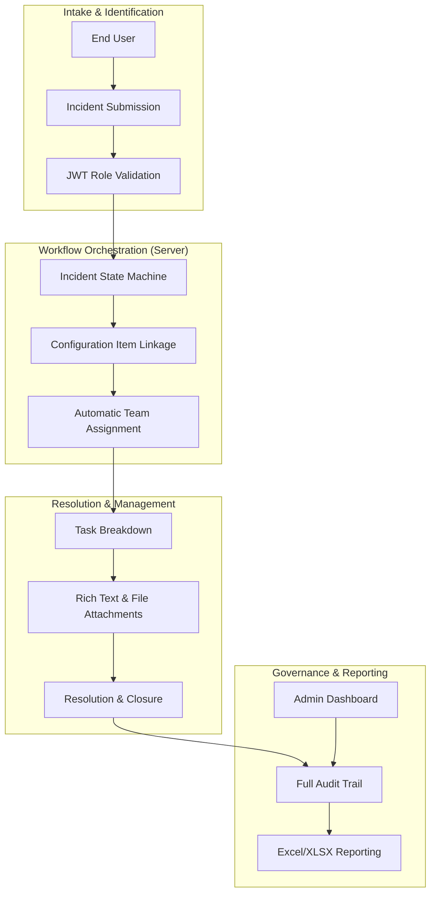

  

    

      

        

          

            <i class="pi pi-briefcase text-primary text-2xl"></i>
            

              
Industry

              
{{$frontmatter.project.domain}}

            

          

        

        

          

            <i class="pi pi-bolt text-primary text-2xl"></i>
            

              
Project Status

              
Scale & Growth

            

          

        

        

          <Stacks :stack="$frontmatter.project.stack" :other-skills="$frontmatter.project.otherSkills" />
        

      

      

        

          
 0" class="flex flex-column gap-3">
            <RazorpayButton :project="$frontmatter.project" page-theme />
          

          

            <a v-if="$frontmatter.project.link" :href="$frontmatter.project.link" target="_blank" class="no-underline">
              <Button label="View Live Demo" icon="pi pi-external-link" severity="primary" class="w-full font-bold py-3" raised rounded />
            </a>
            <a v-if="$frontmatter.project.codeLink" :href="$frontmatter.project.codeLink" target="_blank" class="no-underline">
              <Button label="View Source Code" icon="pi pi-github" severity="secondary" class="w-full font-bold py-3" raised rounded />
            </a>
            <a v-if="$frontmatter.project.contact" :href="'mailto:support@stackseekers.com?subject=' + encodeURIComponent('Scale Request: ' + $frontmatter.project.name)" class="no-underline">
              <Button label="Architect Similar Solution" icon="pi pi-bolt" severity="secondary" class="w-full font-bold py-3" raised rounded />
            </a>
          

        

      

    

  

  

<section v-if="$frontmatter.project.images && $frontmatter.project.images.length" class="mb-8" itemscope itemtype="https://schema.org/SoftwareApplication">
  

    
 1 ? 'md:col-8 lg:col-9' : 'col-12']">
       

         <Image :src="$frontmatter.project.images[0].itemImageSrc" :alt="$frontmatter.project.images[0].alt" preview class="w-full h-full" imageClass="w-full h-full object-cover block min-h-20rem md:min-h-30rem" />
       

    

    
 1" class="col-12 md:col-4 lg:col-3 p-0">
       

          

             

                <Image :src="img.itemImageSrc" :alt="img.alt" preview class="w-full h-full" imageClass="w-full h-full object-cover block min-h-12rem md:min-h-14-5rem" :imageProps="{ loading: 'lazy' }" />
             

          

       

    

    

       

          <Image :src="img.itemImageSrc" :alt="img.alt" preview class="w-full h-full" imageClass="w-full h-full object-cover block min-h-15rem" :imageProps="{ loading: 'lazy' }" />
       

    

    
= 6" class="col-12 md:col-6 lg:col-4 p-2">
       
 6}" @click="$frontmatter.project.images.length > 6 ? displayModal = true : null">
          <Image :src="$frontmatter.project.images[5].itemImageSrc" :alt="$frontmatter.project.images[5].alt" :preview="$frontmatter.project.images.length === 6" class="w-full h-full" imageClass="w-full h-full object-cover block min-h-15rem" :imageProps="{ loading: 'lazy' }" />
          
 6" class="absolute top-0 left-0 w-full h-full flex align-items-center justify-content-center bg-black-alpha-60 text-white hover:bg-black-alpha-40 transition-all transition-duration-300">
             

                <i class="pi pi-images text-4xl mb-2"></i>
                
+{{ $frontmatter.project.images.length - 5 }} More

                
View All Media

             

          

       

    

  

</section>

<section class="mt-4 mb-6">
  
Project Case Study

  
{{$frontmatter.project.description}}

</section>

<section v-if="$frontmatter.project.video" class="mb-8 overflow-hidden border-round-3xl shadow-4 surface-card border-1 border-100">
  

     <iframe 
       class="absolute top-0 left-0 w-full h-full border-none" 
       :src="'https://www.youtube.com/embed/' + ($frontmatter.project.video.includes('v=') ? $frontmatter.project.video.split('v=')[1]?.split('&')[0] : $frontmatter.project.video.split('/').pop())" 
       title="Project Video Showcase" 
       frameborder="0" 
       allow="accelerometer; autoplay; clipboard-write; encrypted-media; gyroscope; picture-in-picture; web-share" 
       referrerpolicy="strict-origin-when-cross-origin" 
       allowfullscreen>
     </iframe>
  

</section>

  <a :href="'mailto:support@stackseekers.com?subject=' + encodeURIComponent('Architectural Consultation: ' + $frontmatter.project.name)" class="no-underline">
    <Button label="Architect Similar Solution" icon="pi pi-bolt" severity="primary" raised rounded class="font-bold px-6 py-3" />
  </a>
  <a :href="'https://wa.me/917026217029?text=' + encodeURIComponent('Hi Jiwan! I saw your ' + $frontmatter.project.name + ' project and would like to discuss a similar strategic architecture.')" target="_blank" rel="noopener noreferrer" class="no-underline">
    <Button label="WhatsApp Connect" icon="pi pi-whatsapp" severity="success" raised rounded class="font-bold px-6 py-3" />
  </a>

<Dialog v-model:visible="displayModal" modal header="Project Media Showcase" :style="{ width: '90vw', maxWidth: '1200px' }" class="p-0 overflow-hidden border-round-3xl" :breakpoints="{'960px': '95vw'}">
  

    

       

          <Image :src="img.itemImageSrc" :alt="img.alt" preview class="w-full h-full" imageClass="w-full h-full object-cover block min-h-15rem" :imageProps="{ loading: 'lazy' }" />
       

    

  

</Dialog>

  

    <TabView class="project-perspective-tabs" v-if="$frontmatter.project.perspective?.executive">
      <TabPanel>
        <template #header>
          

            <i class="pi pi-briefcase"></i>
            Strategic Executive
          

        </template>
        

          

            <i class="pi pi-verified"></i>
            Business Impact & ROI
          

          

            {{ $frontmatter.project.perspective.executive }}
          

          

            

               <h4 class="text-lg font-bold mb-4 flex align-items-center gap-2">
                  <i class="pi pi-list text-primary"></i> Strategic Playbook Features
               </h4>
               

                  

                     

                        <i class="pi pi-check text-primary mt-1"></i>
                        

                     

                  

               

            

          

        

      </TabPanel>
      <TabPanel>
        <template #header>
          

            <i class="pi pi-cog"></i>
            Engineering Architecture
          

        </template>
        

          

            <i class="pi pi-code"></i>
            Technical Deep-Dive
          

          

            {{ $frontmatter.project.perspective.technical }}
          

          

## Engineering Architecture: Enterprise Incident Management Engine

Momentum is a high-performance **Full-Stack ITSM (IT Service Management) platform** designed to replicate the core functionality of enterprise tools like ServiceNow without the associated bloat. It demonstrates a sophisticated **Incident-to-Resolution Lifecycle** powered by a robust role-based workflow engine.

### 1. The Operations Engine (Layman's Perspective)
Think of Momentum as an **Automated Digital Dispatcher**. 

In a busy office, when something breaks (an "Incident"), you normally have to call around, send emails, and hope someone fixes it. This platform acts as the "Dispatcher" who takes the call, instantly categorizes the problem, assigns it to the right "Repair Team" (based on their role), and tracks every step until the job is done. It ensures that nothing falls through the cracks and provides a "Master Dashboard" for management to see exactly how the office is performing in real-time.

### 2. Technical Architecture & Incident Lifecycle
The system utilizes a modern Monorepo architecture, bridging a Vue 3/PrimeVue frontend with a secure Node.js/MongoDB backend.

### 3. Key Engineering Pillars

#### A. State-Driven Workflow Automation
The core of Momentum is a strictly defined **Incident State Machine**. 
- **Deterministic Transitions:** Every ticket follows a validated path (e.g., New -> Assigned -> In Progress -> Resolved). The system prevents "illegal" state jumps, ensuring data integrity for operational audits.
- **Role-Based Visibility:** Using Vue 3 and Pinia, the UI dynamically reconfigures itself based on the user's role. An "End User" sees a simplified submission form, while an "Operations Engineer" sees a complex management console.

#### B. The "Lighter ServiceNow" Pattern
We architected the system to prioritize **Developer Velocity** and **Runtime Performance**.
- **PrimeVue Component Architecture:** By leveraging enterprise-grade components, we delivered a "ServiceNow-like" UX in a fraction of the time, focusing our engineering effort on the business logic rather than the UI primitives.
- **Decoupled API Design:** The backend is built as a RESTful API with full Swagger documentation, allowing for future integrations with third-party automation tools or custom Slack/Teams bots.

#### C. Integrated Configuration Management (CMDB)
Unlike simple task lists, Momentum includes a lightweight **Configuration Item (CI) Model**.
- **Asset Linkage:** Incidents are linked to specific IT assets (Servers, Software, Hardware). This allows for "Impact Analysis"—identifying how a single server failure might affect multiple business services.

### 4. Strategic Business Value (ROI)
- **Enterprise Capabilities, Startup Speed:** Provides the structure of an enterprise ITSM tool with the agility of a custom-built solution.
- **Operational Transparency:** Replaces fragmented emails and spreadsheets with a single, searchable "Source of Truth" for all business operations.
- **Cost Efficiency:** Eliminates the high licensing fees of enterprise platforms while providing a system that is 100% tailored to the company's specific workflows.

Momentum proves that **Targeted Product Architecture** can outperform generic enterprise software by focusing on the specific operational needs of the business.

</TabPanel>
</TabView>

  <h3 class="text-2xl font-bold mb-4 flex align-items-center gap-2">
     <i class="pi pi-list text-primary"></i> Playbook Features
  </h3>
  

     

        

           <i class="pi pi-verified text-primary mt-1"></i>
           

        

     

  

  

    

      <h3 class="text-2xl font-bold m-0 flex align-items-center gap-2">
        <i class="pi pi-building text-primary"></i>
        {{ $frontmatter.project.relatedCaseStudy.title }}
      </h3>
      
{{ $frontmatter.project.relatedCaseStudy.description }}

    

    

      <a :href="$frontmatter.project.relatedCaseStudy.link" class="no-underline">
        <Button :label="$frontmatter.project.relatedCaseStudy.buttonText" icon="pi pi-arrow-right" iconPos="right" severity="primary" raised rounded class="font-bold white-space-nowrap" />
      </a>
    

  

<ConsultingBridge />

      <h3 class="text-2xl font-bold mb-4 flex align-items-center gap-2">
        <i class="pi pi-cog text-primary"></i>
        Related Engineering Services
      </h3>
      

        <a href="/web-development-services/product-architecture-and-scaling/" class="no-underline px-4 py-2 surface-0 shadow-1 border-round-xl text-700 font-bold hover:text-primary transition-all">Custom Software</a>
        <a href="/web-development-services/saas-mvp-development/" class="no-underline px-4 py-2 surface-0 shadow-1 border-round-xl text-700 font-bold hover:text-primary transition-all">MVP Development</a>
        <a href="/web-development-services/ai-and-automation-strategy/" class="no-underline px-4 py-2 surface-0 shadow-1 border-round-xl text-700 font-bold hover:text-primary transition-all">AI & Automation</a>
      

    

  

<section class="mt-8">
  

    

    <h2 class="text-3xl md:text-5xl font-bold mb-4 relative z-1">Need a similar strategic architecture?</h2>
    
If this project aligns with your current bottlenecks, let's discuss how to apply these same principles to your business.

    

      <a :href="'/contact/?subject=' + encodeURIComponent('Inquiry regarding ' + $frontmatter.project.name)" class="no-underline">
        <Button label="Start Your Project Brief" icon="pi pi-file-edit" severity="primary" raised rounded />
      </a>
      <a :href="'https://cal.com/stackseekers/25min?utm_source=website&utm_medium=portfolio&utm_campaign=' + $frontmatter.project.name.toLowerCase().replace(/[^a-z0-9]+/g, '-')" target="_blank" class="no-underline">
        <Button label="Book Technical Roadmap Audit" icon="pi pi-calendar-clock" severity="secondary" raised rounded />
      </a>
    

  

</section>

  

    <a v-if="$frontmatter.project.previousProject" :href="$frontmatter.project.previousProject.link" class="flex align-items-center no-underline text-color-secondary hover:text-primary group">
      <i class="pi pi-chevron-left mr-2 transition-transform group-hover:-translate-x-1"></i>
      

        Previous
        {{ $frontmatter.project.previousProject.name }}
      

    </a>
  

  

    <a href="/web-development-projects/" class="no-underline text-color-secondary hover:text-primary font-bold">
      <i class="pi pi-th-large mr-2"></i>
      Portfolio
    </a>
  

  

    <a v-if="$frontmatter.project.nextProject" :href="$frontmatter.project.nextProject.link" class="flex align-items-center justify-content-end no-underline text-color-secondary hover:text-primary group">
      

        Next
        {{ $frontmatter.project.nextProject.name }}
      

      <i class="pi pi-chevron-right ml-2 transition-transform group-hover:translate-x-1"></i>
    </a>
  

